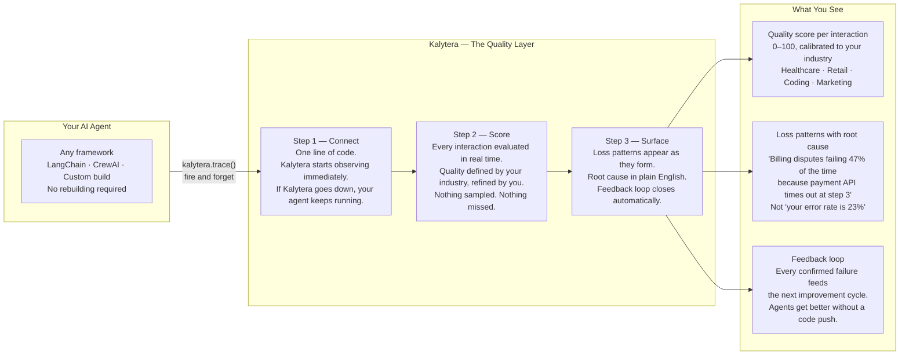

# Kalytera — How It Works

> **Audience:** Investors, developers evaluating Kalytera, design partners.
> This diagram deliberately omits implementation details — model names, table schemas,
> queue mechanics, retry logic, and all internal code. The moat lives below this layer.
> Edit this file freely — it is a Mermaid diagram in plain Markdown.



## Three things no existing tool does together

| | LangSmith | Braintrust | Maxim | **Kalytera** |
|--|-----------|------------|-------|-------------|
| 100% coverage — nothing sampled | Samples | Samples | Samples | **Yes** |
| Loss patterns surface automatically | No | No | Partial | **Yes** |
| Feedback loop — same failures don't repeat | No | No | No | **Yes** |
| Industry quality standards out of the box | No | No | No | **Yes** |

## The three-step developer experience

```
# Step 1 — one line of code
kalytera.trace(session_id=..., user_input=..., agent_response=..., response_time_ms=...)

# Step 2 — quality scores appear in the dashboard within 30 seconds

# Step 3 — loss patterns surface with root cause as they form
# "Billing disputes fail 47% of the time because payment API times out at step 3"
# Happening since last Tuesday. 23 sessions affected.
```

## What developers fix in minutes, not hours

Before Kalytera: "The agent has a 23% failure rate."
After Kalytera: "Billing disputes fail because the payment API times out at step 3. Happening since last Tuesday. Here's the fix."
