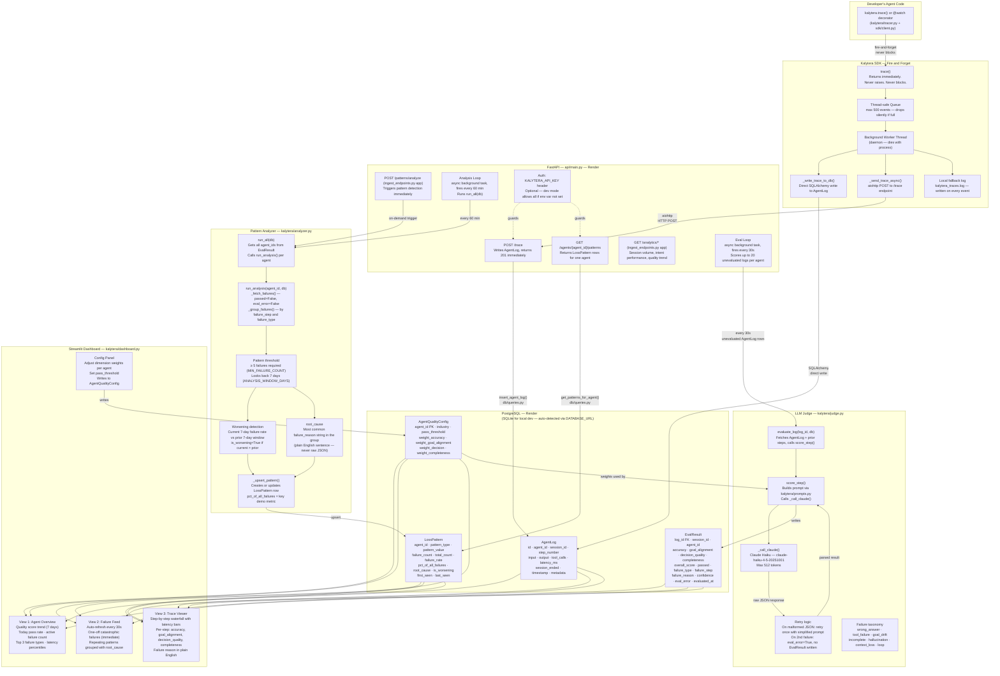

# Kalytera — Internal Architecture

> **Audience:** Priya and engineering collaborators. Full implementation detail.
> Edit this file freely — it is a Mermaid diagram in plain Markdown.



## Key constraints (do not violate)

| Constraint | Where enforced |
|-----------|---------------|
| `trace()` never raises, never blocks | `sdk/client.py:trace()` — entire body in try/except |
| Queue drops silently if full | `Queue(maxsize=500)` + `put_nowait()` |
| Eval never runs in trace path | Background loop only — eval runs 30s after trace |
| `failure_reason` is one plain English sentence | Judge prompt explicitly requires it |
| Raw judge JSON never exposed to API clients | Route returns `PatternOut` / `TraceResponse` only |
| All SQL in `db/queries.py` | No inline SQL in routes or service functions |
| Multi-tenant isolation | Every query filtered by `agent_id` |

## Background loop timing

```
t=0s     Developer calls trace() → queue → DB write (< 1ms)
t=30s    Eval loop fires → judge scores new AgentLog rows → EvalResult written
t=3600s  Analysis loop fires → run_all(db) → LossPattern rows written
```

Dashboard auto-refreshes every 30s — patterns appear within ~1 hour of failures starting.
